<picture>
  <source media="(prefers-color-scheme: dark)" srcset="assets/header-dark.svg">
  <source media="(prefers-color-scheme: light)" srcset="assets/header-light.svg">
  
</picture>

Frontend dev (React, Next.js, Three.js) building agent skills and tooling for Claude Code.
[devdwin.com](https://devdwin.com "Personal site")

### [3d-logo-skill](https://github.com/hasuwini77/3d-logo-skill) — any flat logo → a 3D spinning coin

<a href="https://hasuwini77.github.io/3d-logo-skill/"></a>

```bash
npx skills add hasuwini77/3d-logo-skill
```

The rim traces your logo's actual outline, not a circle. [Try it live →](https://hasuwini77.github.io/3d-logo-skill/)
