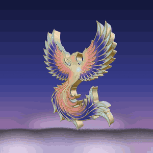
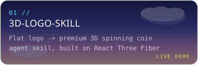
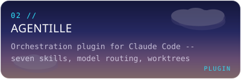
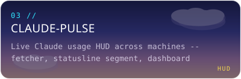
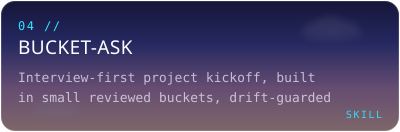
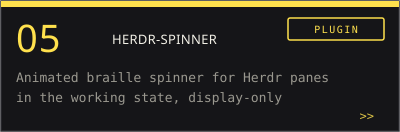
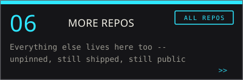
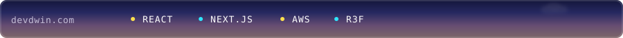

<picture>
  <source media="(prefers-color-scheme: dark)" srcset="assets/header-dark.svg">
  <source media="(prefers-color-scheme: light)" srcset="assets/header-light.svg">
  
</picture>

<picture>
  <source media="(prefers-color-scheme: dark)" srcset="assets/coin-dark.gif">
  <source media="(prefers-color-scheme: light)" srcset="assets/coin-light.gif">
  
</picture>

Senior frontend dev (React, Next.js, AWS) building small SaaS and the agent tooling I wish existed for Claude Code. Everything below is public and running.

 

<picture>
  <source media="(prefers-color-scheme: dark)" srcset="assets/section-01-dark.svg">
  <source media="(prefers-color-scheme: light)" srcset="assets/section-01-light.svg">
  
</picture>

<a href="https://github.com/hasuwini77/3d-logo-skill"><picture><source media="(prefers-color-scheme: dark)" srcset="assets/card-3d-logo-skill-dark.svg"><source media="(prefers-color-scheme: light)" srcset="assets/card-3d-logo-skill-light.svg"></picture></a> <a href="https://github.com/hasuwini77/agentille"><picture><source media="(prefers-color-scheme: dark)" srcset="assets/card-agentille-dark.svg"><source media="(prefers-color-scheme: light)" srcset="assets/card-agentille-light.svg"></picture></a>
<a href="https://github.com/hasuwini77/claude-pulse"><picture><source media="(prefers-color-scheme: dark)" srcset="assets/card-claude-pulse-dark.svg"><source media="(prefers-color-scheme: light)" srcset="assets/card-claude-pulse-light.svg"></picture></a> <a href="https://github.com/hasuwini77/bucket-ask"><picture><source media="(prefers-color-scheme: dark)" srcset="assets/card-bucket-ask-dark.svg"><source media="(prefers-color-scheme: light)" srcset="assets/card-bucket-ask-light.svg"></picture></a>
<a href="https://github.com/hasuwini77/herdr-spinner"><picture><source media="(prefers-color-scheme: dark)" srcset="assets/card-herdr-spinner-dark.svg"><source media="(prefers-color-scheme: light)" srcset="assets/card-herdr-spinner-light.svg"></picture></a> <a href="https://github.com/hasuwini77?tab=repositories"><picture><source media="(prefers-color-scheme: dark)" srcset="assets/card-more-repos-dark.svg"><source media="(prefers-color-scheme: light)" srcset="assets/card-more-repos-light.svg"></picture></a>

<picture>
  <source media="(prefers-color-scheme: dark)" srcset="assets/stack-strip-dark.svg">
  <source media="(prefers-color-scheme: light)" srcset="assets/stack-strip-light.svg">
  
</picture>
