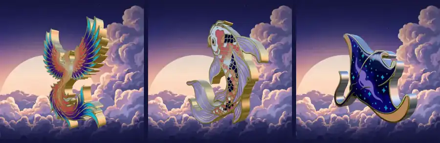

<picture>
  <source media="(prefers-color-scheme: dark)" srcset="assets/header-dark.svg">
  <source media="(prefers-color-scheme: light)" srcset="assets/header-light.svg">
  
</picture>

Frontend dev (React, Next.js, Three.js) building agent skills and tooling for Claude Code.
[devdwin.com](https://devdwin.com "Personal site")

### [3d-logo-skill](https://github.com/hasuwini77/3d-logo-skill) — any flat logo → a 3D spinning coin

<a href="https://hasuwini77.github.io/3d-logo-skill/"></a>

```bash
npx skills add hasuwini77/3d-logo-skill
```

The rim traces your logo's actual outline, not a circle. [Try it live →](https://hasuwini77.github.io/3d-logo-skill/)

### Also building

- [demo-reel](https://github.com/hasuwini77/demo-reel) — frame-exact 60 fps demo videos of any web app, recorded from a script
- [ccstatusline-nocturne](https://github.com/hasuwini77/ccstatusline-nocturne) — status line themes for Claude Code: two layouts, five palettes
- [claude-pulse](https://github.com/hasuwini77/claude-pulse) — live Claude usage HUD: 5-hour and weekly windows, reset countdowns
- [herdr-spinner](https://github.com/hasuwini77/herdr-spinner) — animated braille spinner for busy Herdr panes
