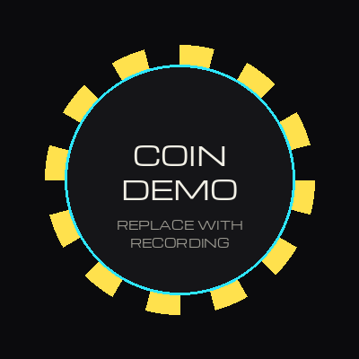
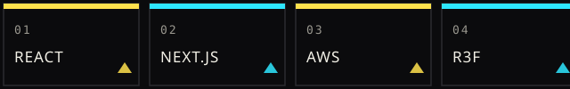

<picture>
  <source media="(prefers-color-scheme: dark)" srcset="assets/header-dark.svg">
  <source media="(prefers-color-scheme: light)" srcset="assets/header-light.svg">
  
</picture>

Senior frontend dev (React, Next.js, AWS) building small SaaS and the agent tooling I wish existed for Claude Code. Everything below is public and running.

### NOW SHIPPING

| # | | |
|---|---|---|
| `01` | [**3D LOGO SKILL**](https://github.com/hasuwini77/3d-logo-skill) | Flat logo → premium 3D spinning coin agent skill (React Three Fiber). [Live demo ↗](https://hasuwini77.github.io/3d-logo-skill/) |
| `02` | [**AGENTILLE**](https://github.com/hasuwini77/agentille) | Orchestration plugin for Claude Code — seven skills, model routing, parallel git worktrees. |
| `03` | [**CLAUDE-PULSE**](https://github.com/hasuwini77/claude-pulse) | Live Claude usage HUD — cross-platform fetcher, statusline segment, GitHub Pages dashboard. |
| `04` | [**BUCKET-ASK**](https://github.com/hasuwini77/bucket-ask) | Interview-first project kickoff — find the real goal, build in small reviewed buckets. |
| `05` | [**HERDR-SPINNER**](https://github.com/hasuwini77/herdr-spinner) | Animated braille spinner for Herdr panes in the working state. |

  
   
  ↑ placeholder — swapped for a recording of the 3D-LOGO-SKILL coin

<picture>
  <source media="(prefers-color-scheme: dark)" srcset="assets/pit-board-dark.svg">
  <source media="(prefers-color-scheme: light)" srcset="assets/pit-board-light.svg">
  
</picture>

[devdwin.com](https://devdwin.com) · React · Next.js · AWS · R3F
