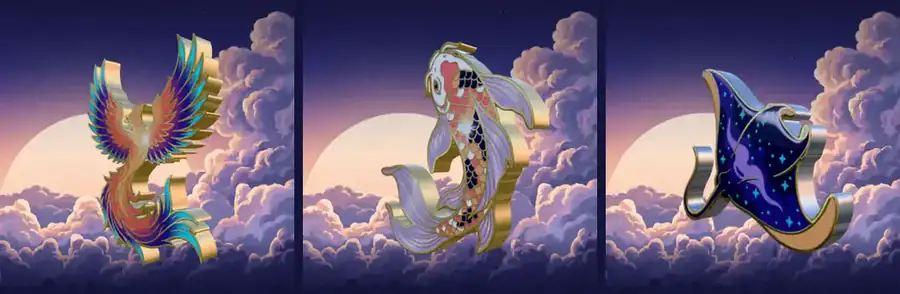

<picture>
  <source media="(prefers-color-scheme: dark)" srcset="assets/header-dark.svg">
  <source media="(prefers-color-scheme: light)" srcset="assets/header-light.svg">
  
</picture>

Frontend dev (React, Next.js, Three.js) building agent tooling for Claude Code · [devdwin.com](https://devdwin.com "Personal site")

- [agentille](https://github.com/hasuwini77/agentille) — orchestration plugin for Claude Code
- [3d-logo-skill](https://github.com/hasuwini77/3d-logo-skill) — any flat logo → a 3D spinning coin · [try it](https://hasuwini77.github.io/3d-logo-skill/ "Live demo")
